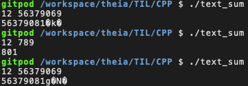
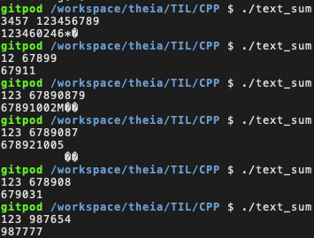

아직 정리 어떻게 할지 결정 못함.
형식은 나중에 고치면 되지.

오늘은 문자열 입력을 받아서 덧셈 연산 하는 걸 구현해봄.
문자열 처리가 좀 약한 거 같다.

기본적인 아이디어는 std::string으로 받아서서 const char*로 바꾸고
마지막 자릿수부터 연산한 다음 문자 0을 빼준다.

고려했던 부분
1. '3'과 '2'를 통해 '5'를 산출하는 것.
2. 자릿수 올림이 발생할 경우. ('5'와 '6'의 연산으로 '1'을 store하고 다음 자리에 '1'을 가산)
3. 입력받은 두 수의 자릿수가 다를 경우.
4. 두 수의 덧셈 연산 결과가 두 수의 자릿수보다 클 경우.

1은 '3'과 '2'를 더한 값에 '0'을 빼서 산출했다.
2는 전가산기 생각하면서 sum, carry 써서 구현했다.
3은 내일할것임 4도 내일할것임 쓰지않은 5는 입력받을 자릿수를 특정할 수 없을 경우에 대한 고려임 이것도 내일
+ Theia는 왜 저장하면 tab을 맘대로 2space로 변환하는 것인가 preference 바꿔봤는데 차이가 없다
+ 마크다운 문법이 이것저것 있었던거같지만 아몰라울;만이ㅏ러미

어제에 이어서 씀(아직 형식 못정함)

일단 각 조건에서 다 동작하게 만들 것이다. 코드 간소화 및 최적화는 그 다음에 생각할것.
(물론 짜다가 좋은 간소화가 생각나버리면 즉각 반영해버릴것이다 하지만 좋은 간소화를 생각하느라 구현이 지체되면 안됨)

조건 3. 입력받은 두 수의 자릿수가 다를 경우에 대해 구현했는데, 짧은 자릿수에선 문제 없는 거 같은데 긴 자릿수에서 이상한 문자가 뒤에 붙는다.
왜죠(맞왜틀)

6자리까진 문제 없는 것 같다.

해결하고 싶은데 뇌버깅하기엔 너무 피곤 && 늦어서 여기까지.
